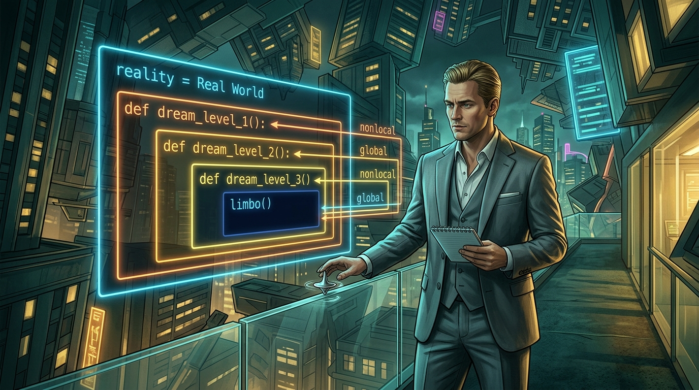
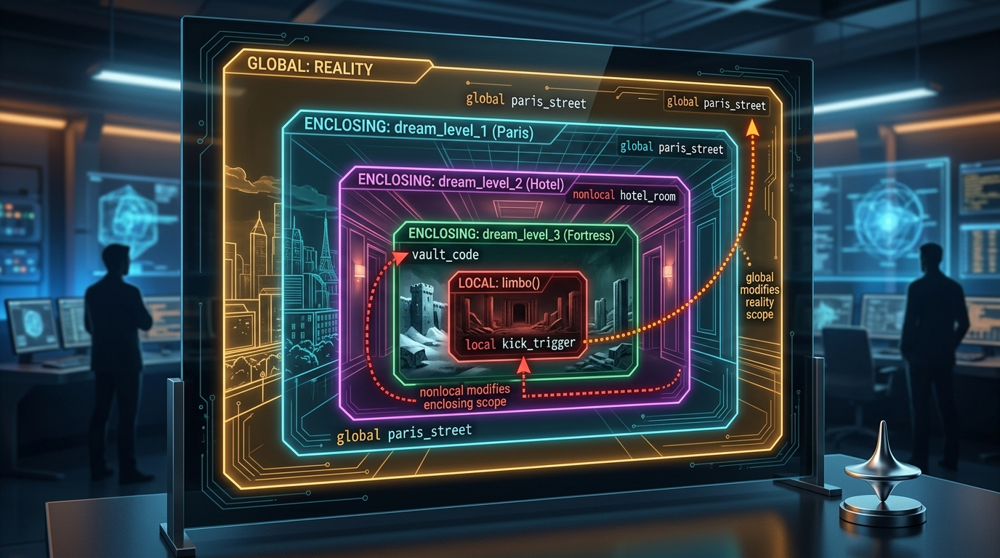

# 🎬 Práctica de Git: El Desafío Inception (Ramas y Merge)

Esta práctica combina el aprendizaje de **Git (flujo de ramas, commits y merge)** con la resolución y mejora de código en **Python (variables globales, ámbito léxico LEGB y `nonlocal`)**.



---

## 🎯 Objetivo de la Práctica
1. Trabajar en una rama secundaria independiente sin tocar directamente `main`.
2. Mejorar o refactorizar el código de [`scope_inception.py`](./scope_inception.py).
3. Confirmar los cambios con commits limpios y descriptivos.
4. Integrar (*mergear*) la rama en `main`.
5. Subir los cambios a GitHub (`git push`).

---

## 📜 El Código Base: Metáfora de Inception y la Regla LEGB

En Python, la resolución de variables sigue el orden **LEGB** (Local ➔ Enclosing ➔ Global ➔ Built-in). El script base modela exactamente la trama de la película *Origen (Inception)*:



- **GLOBAL**: `reality = "Real World"` (El mundo exterior en el avión Boeing 747).
- **ENCLOSING (Nivel 1)**: `dream_level_1()` (La furgoneta bajo la lluvia en París/LA).
- **ENCLOSING (Nivel 2)**: `dream_level_2()` (El hotel sin gravedad de Arthur).
- **ENCLOSING (Nivel 3)**: `dream_level_3()` (La fortaleza de nieve de Eames).
- **LOCAL**: `limbo()` (El abismo más profundo del subconsciente).

Las palabras clave de Python actúan como los saltos del sueño:
- `global`: Permite alterar la realidad exterior desde el nivel más profundo.
- `nonlocal`: Permite modificar variables de un nivel de sueño intermedio superior sin alterar la realidad exterior.

---

## 🛠️ Guía Paso a Paso para el Alumno

### Paso 1: Asegurarte de estar en la rama `main` actualizada
```bash
git checkout main
git pull origin main
```

### Paso 2: Crear y cambiar a una rama de trabajo
```bash
git checkout -b feature/mejora-inception-tu-nombre
# o con la sintaxis moderna:
git switch -c feature/mejora-inception-tu-nombre
```

### Paso 3: Probar y modificar el código
1. Ejecuta el script base:
   ```bash
   python3 git/practica-inception/scope_inception.py
   ```
2. Realiza tu mejora en el código. Consulta ideas en la carpeta de [Soluciones y Variantes](./soluciones/).

### Paso 4: Confirmar tus cambios en la rama
```bash
git status
git add git/practica-inception/scope_inception.py
git commit -m "feat(inception): mejorar niveles de sueño y control de variables de scope"
```

### Paso 5: Mergear la rama a `main`
```bash
git checkout main
git merge feature/mejora-inception-tu-nombre
```

### Paso 6: Subir los cambios a GitHub
```bash
git push origin main
```

---

## 💡 Banco de Ideas y Soluciones de Referencia
En la carpeta [`soluciones/`](./soluciones/) tienes 6 implementaciones avanzadas disponibles para inspirarte:
1. **[`01_totem_verification.py`](./soluciones/01_totem_verification.py)**: Comprobación con peonza/tótem orientada a objetos.
2. **[`02_cuarto_nivel_subconsciente.py`](./soluciones/02_cuarto_nivel_subconsciente.py)**: 4º nivel de profundidad con múltiples variables `nonlocal`.
3. **[`03_comunicacion_senales_telemetria.py`](./soluciones/03_comunicacion_senales_telemetria.py)**: Bus de telemetría de señales compartidas por referencia.
4. **[`04_the_kick_generadores_yield.py`](./soluciones/04_the_kick_generadores_yield.py)**: Sincronización de "The Kick" mediante `yield` y `.send()`.
5. **[`05_context_managers_sedante_yusuf.py`](./soluciones/05_context_managers_sedante_yusuf.py)**: Dilatación temporal administrada con `with dream_layer(...)`.
6. **[`06_sueno_recursivo_espejos_ariadne.py`](./soluciones/06_sueno_recursivo_espejos_ariadne.py)**: Sueño fractal recursivo (espejos infinitos de Ariadne).
