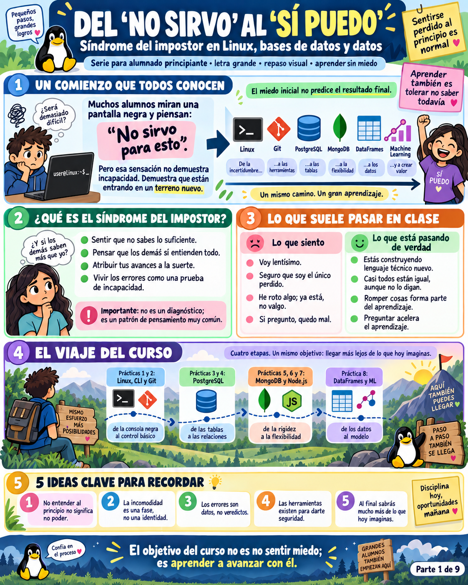
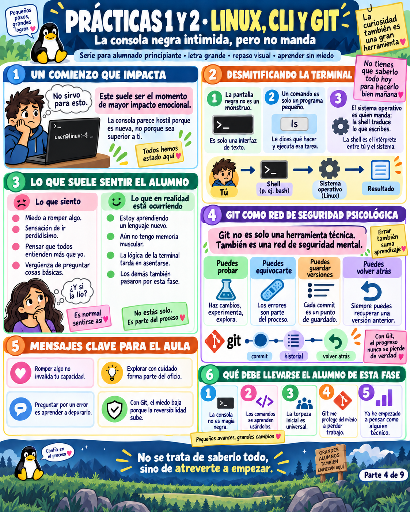
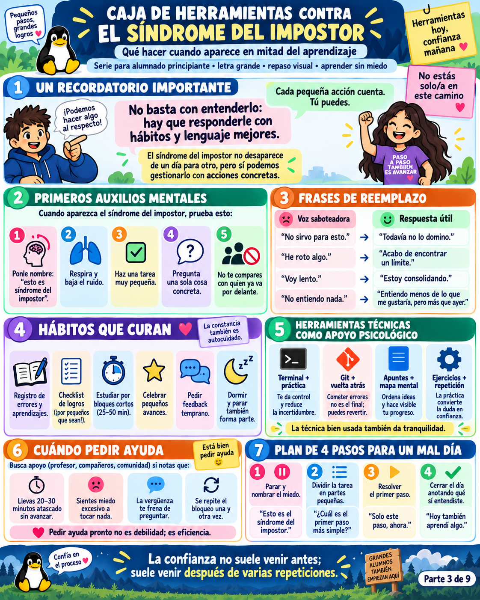
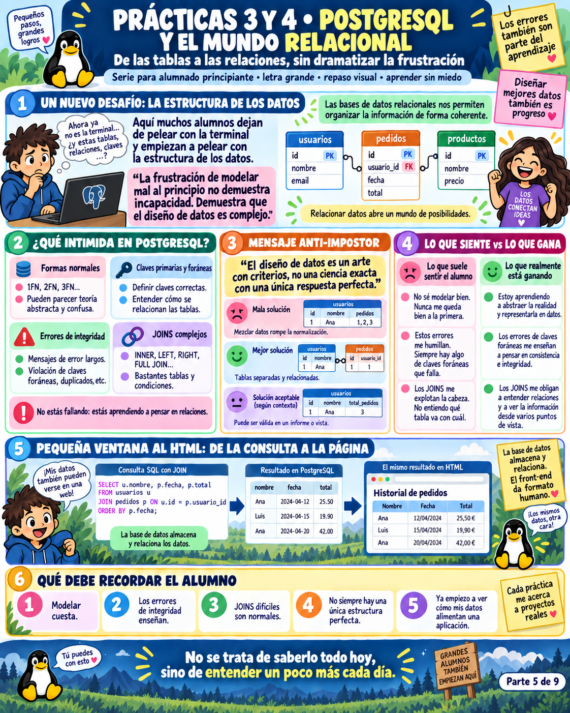
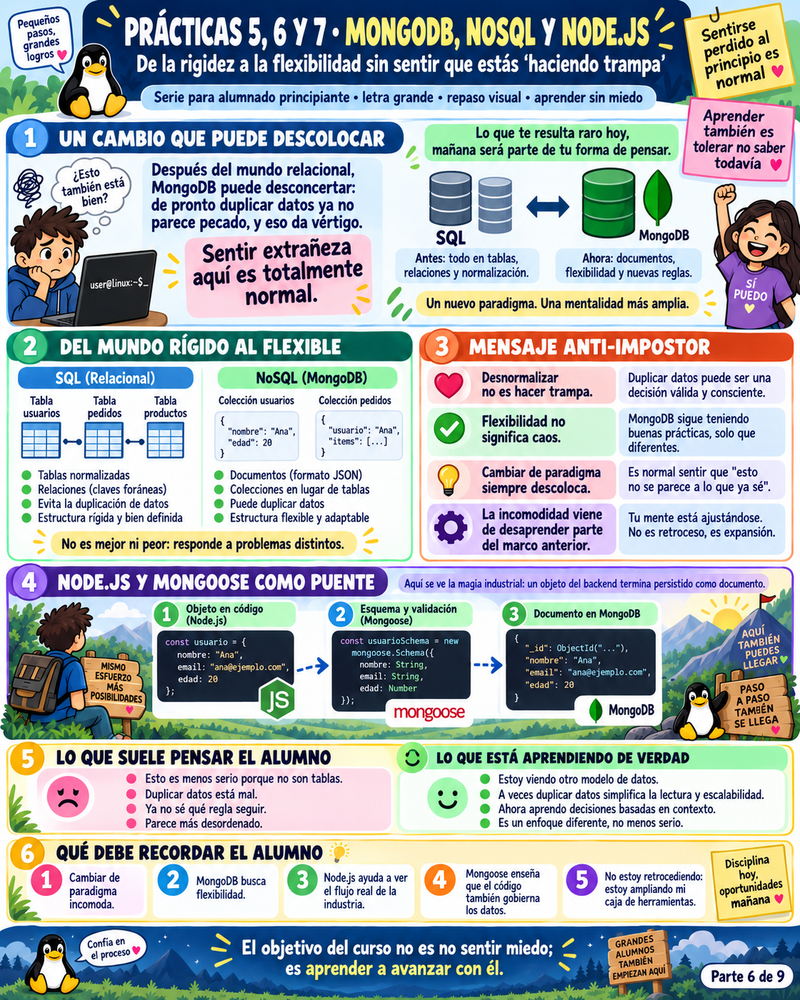
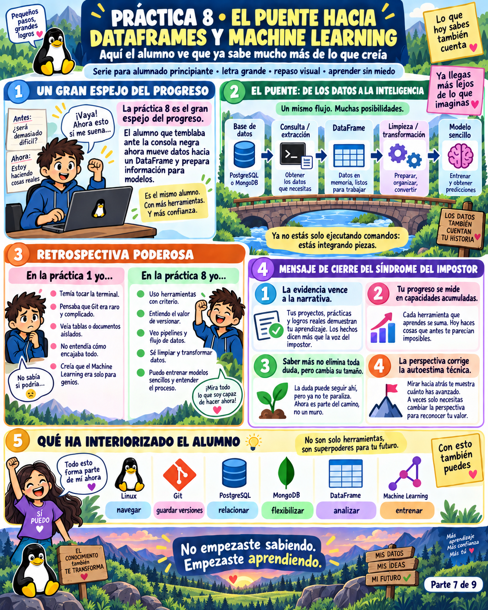
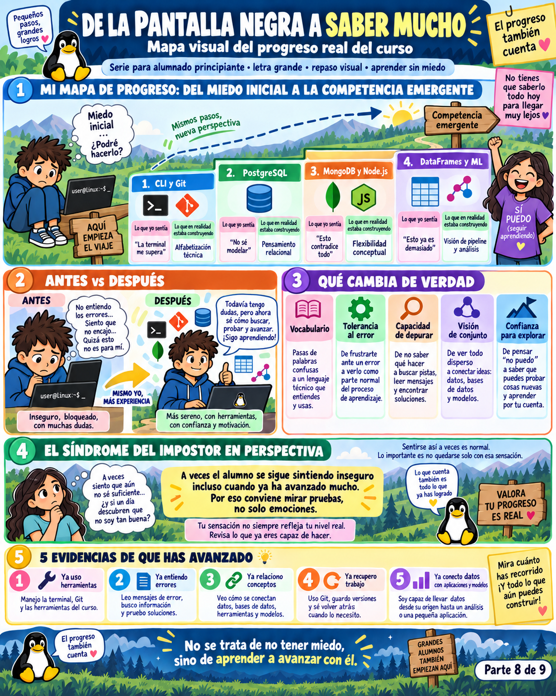

# 🧠 El Fantasma en la Pantalla Negra: Crónica del Síndrome del Impostor en Tecnología
### *Guía Narrativa, Desmitificación Psicológica y Banco de Preguntas para el Debate en el Aula*

---

> *"Todos los alumnos miran alguna vez la pantalla negra parpadeante y escuchan un susurro: 'No sirves para esto. Todos los demás lo entienden menos tú. En cualquier momento se darán cuenta de que eres un fraude'.*  
> *Esa voz no es un diagnóstico de incapacidad. Es el peaje humano de entrar en un territorio nuevo."*

---

## 📖 PARTE 1: La Historia de Álex (El Espejo en el que Todos nos Miramos)

### Capítulo 1: El Abismo de la Consola Negra
Eran las nueve de la mañana del primer día de clase. **Álex** miraba fijamente el monitor de su portátil. La pantalla estaba en negro, salvo por un cursor blanco parpadeante precedido de una línea enigmática:

```bash
user@linux:~$ _
```

A su izquierda, **Sofía** tecleaba con aparente serenidad; a su derecha, otro compañero asentía como si la arquitectura de un sistema operativo fuera algo que se aprende en la guardería. Álex sintió un nudo en el estómago. Tragó saliva y pensó:  
> *«Me he equivocado de curso. Esta gente sabe cosas que yo jamás entenderé. Si escribo un comando y pulso Enter, voy a romper el ordenador. Es cuestión de días que el profesor descubra que no pinto nada aquí».*



Lo que Álex no sabía es que, en ese mismo instante, **Sofía estaba pensando exactamente lo mismo sobre él**:  
> *«Álex parece tan concentrado y callado... Seguro que ya ha programado en Python antes. Como me pregunte algo el profesor, voy a hacer el ridículo».*

Este es el primer secreto del aula tecnológica: **el síndrome del impostor es una epidemia invisible**. Casi todo el mundo lo padece, pero como nadie lo verbaliza por vergüenza, cada alumno asume erróneamente que es el único náufrago en medio del océano.

---

### Capítulo 2: El Bucle Infinito del Sabotaje Mental
A medida que pasaban los días, Álex cayó en lo que los psicólogos llaman **el Ciclo del Impostor**:


1. **El Reto:** El profesor plantea un ejercicio de terminal o de modelado de datos.
2. **La Inseguridad:** Álex duda de su primer paso (*«¿Era `ls -la` o `rm`?»*).
3. **La Comparación:** Mira alrededor y asume que el silencio ajeno equivale a comprensión absoluta.
4. **El Bloqueo:** La tensión congela sus dedos sobre el teclado.
5. **El Error inevitable:** Escribe un comando, la terminal escupe un mensaje en letras rojas y Álex concluye: *«He roto algo; definitivamente no valgo»*.
6. **La Interpretación Catastrófica:** Si el código funciona, se lo atribuye a la suerte; si falla, se lo atribuye a su supuesta torpeza genética.

---

### Capítulo 3: El Descubrimiento de Git y la Caja de Herramientas
La revelación de Álex no llegó comprendiendo un teorema abstracto, sino una tarde lluviosa durante la clase de **Git**:

El profesor pidió a la clase que borrara una función crítica y ejecutara:
```bash
git restore .
```
De repente, los archivos borrados reaparecieron intactos en milisegundos.



Álex se quedó mirando la pantalla. El profesor sonrió y dijo:  
> *«Git no es solo un software de control de versiones. **Git es una red de seguridad psicológica.** Está diseñado para recordarte que en informática casi nada es irreversible. Equivocarse no es el final; es simplemente un commit que aún no has perfeccionado».*

A partir de ese día, Álex empezó a aplicar la **Caja de Herramientas Anti-Impostor**:



- **Nombrar al monstruo:** En cuanto sentía el nudo en la garganta, se decía mentalmente: *«Esto no es incompetencia; es el síndrome del impostor hablando»*.
- **Frases de reemplazo:**  
  - En vez de *«No sirvo para esto»* ➔ *«Todavía no lo domino, pero estoy construyendo lenguaje nuevo»*.  
  - En vez de *«He roto algo»* ➔ *«Acabo de descubrir un límite del sistema y una pista para depurar»*.
- **La regla de los 20 minutos:** Si llevaba 20 minutos atascado en un error de sintaxis, levantaba la mano. Descubrió que cuando preguntaba, tres compañeros más respiraban aliviados porque tenían la misma duda.

---

### Capítulo 4: Las Montañas Rusas del Aprendizaje (PostgreSQL, Mongo y DataFrames)
El viaje no fue una línea recta. Cada vez que Álex dominaba una herramienta, el temario cambiaba de paradigma y el impostor volvía a tocar la puerta:

1. **En PostgreSQL:** La frustración de las formas normales y los `JOINs` múltiples. Sentía que sus tablas eran un desastre hasta que entendió que modelar es un arte con criterios, no una ciencia exacta:


2. **En MongoDB y Node.js:** De repente, duplicar datos en un documento JSON no estaba prohibido. Sintió que estaba "haciendo trampa" hasta que asimiló que diferentes problemas exigen diferentes estructuras:


3. **La Práctica Final de Machine Learning y DataFrames:**  
Tres meses después, Álex estaba importando un CSV en Pandas, limpiando valores nulos, ejecutando consultas SQL, versionando en Git y entrenando un modelo de predicción.



Miró hacia atrás. La pantalla negra que al principio le causaba taquicardia ahora era su espacio de trabajo natural. Seguía sin saberlo todo —ningún ingeniero en el planeta lo sabe todo—, pero había aprendido la habilidad más valiosa del sector tecnológico: **tolerar la incertidumbre y saber depurar con calma.**



---

## 🧩 PARTE 2: ¿Por qué la Tecnología es el Caldo de Cultivo Perfecto para el Impostor?

Para desarmar este fenómeno, debemos entender por qué afecta con tanta virulencia a programadores, científicos de datos y administradores de sistemas:

1. **Vocabulario abrumador e hiper-especializado:**  
   En una sola semana un alumno escucha términos como *Kernel, Bash, inodo, SIGKILL, clave foránea, B-Tree, NoSQL, ORM, pipeline, broadcasting, overfitting*. Es natural que el cerebro sienta sobrecarga cognitiva.
2. **El error es inmediato y público:**  
   En otras disciplinas, un borrador imperfecto pasa desapercibido. En software, un punto y coma ausente o un espacio de tabulación hace que el programa estalle con una traza de error en la cara del alumno.
3. **El mito del «Hacker Genio Solitario»:**  
   Las películas han vendido la imagen de genios que teclean a la velocidad de la luz sin consultar documentación. En la vida real, los mejores ingenieros senior de Google o Microsoft pasan el 60% de su jornada buscando errores en StackOverflow, leyendo documentación oficial y probando hipótesis.
4. **La tecnología es un horizonte móvil:**  
   Nunca se llega a la meta. Cuando dominas una librería, aparece una nueva versión o una arquitectura distinta. El éxito no consiste en saberlo todo, sino en aprender a aprender.

---

## 🤝 PARTE 3: El Clima del Aula y el Contrato Psicológico


Para que el aprendizaje sea transformador, el aula debe convertirse en un **laboratorio libre de juicio**.

### Palabras que Construyen vs Palabras que Destruyen

| 🚫 Frases tóxicas a erradicar en clase | ✅ Frases que generan seguridad y avance |
| :--- | :--- |
| *"Esto es facilísimo."* | *"Es normal que cueste al principio; requiere práctica."* |
| *"Ya deberíais saber esto."* | *"Vamos a repasar este concepto desde la base."* |
| *"¿Cómo no lo entiendes todavía?"* | *"Muéstrame el mensaje de error exacto y lo leemos juntos."* |
| *"Es obvio."* | *"Lo que para uno es evidente, para otro es completamente nuevo."* |

### 📜 El Contrato de Honor del Bootcamp
1. **Se premia la pregunta valiente:** Preguntar nunca es signo de debilidad; es acelerar el aprendizaje del grupo.
2. **Los errores son datos, no veredictos:** Un `SyntaxError` no dice que seas torpe; solo dice que al intérprete le falta un carácter.
3. **No compares tu capítulo 1 con el capítulo 20 de otra persona:** Cada alumno viene con un bagaje previo distinto. Tu única métrica real de progreso es comparar quién eres hoy con quién eras hace dos semanas.

---

## 🗣️ PARTE 4: Banco de Preguntas para Dinámicas y Debates en Clase

Utiliza estas preguntas para abrir debates grupales, mesas redondas o dinámicas de reflexión en tutorías:

### 🟢 Bloque A: Rompiendo el Hielo (Semana 1 - El Miedo a la Consola)
1. **La primera impresión:** *Cuando abriste la terminal por primera vez y viste la pantalla negra sin botones, ¿cuál fue el primer pensamiento espontáneo que cruzó por tu mente?*
2. **El fantasma del vecino:** *¿Alguna vez has mirado la pantalla de un compañero pensando 'él/ella sí que sabe lo que hace y yo estoy perdidísimo'? ¿Qué evidencias reales tenías para creer eso?*
3. **El tabú del error:** *¿Por qué nos da tanta vergüenza levantar la mano en clase para decir "no sé qué significa este error"? ¿Qué tememos que piensen los demás?*

---

### 🟡 Bloque B: Creencias y Falsos Mitos (Semana 3 a 5 - Bases de Datos y Lógica)
4. **¿Facilidad o esfuerzo?:** *Existe el mito de que si tienes talento para la informática 'todo te sale a la primera'. Cuando un ejercicio te cuesta horas resolverlo, ¿lo interpretas como una prueba de tu incapacidad o como el proceso normal de construcción neuronal?*
5. **La trampa de la comparación:** *En plataformas como LinkedIn, la gente solo publica sus éxitos, certificaciones y proyectos impecables. ¿Cómo influye el 'éxito artificial' de las redes sociales en nuestro propio sentimiento de impostor?*
6. **El valor de romper cosas:** *¿Qué aprendiste la última vez que borraste un archivo sin querer, rompiste una base de datos o bloqueaste un script? ¿Fue un fracaso o el momento en que mejor entendiste cómo funcionaba el sistema por dentro?*

---

### 🔴 Bloque C: La Identidad Profesional y el Futuro (Semana 8 - Hacia el Mundo Laboral)
7. **¿Cuándo se deja de ser junior?:** *¿Crees que los programadores senior dejan de sentir alguna vez el síndrome del impostor? ¿Qué diferencia a un profesional experimentado de un novato ante una tecnología desconocida?*
8. **Tu inventario de victorias:** *Si viajaras en el tiempo al día 1 del bootcamp y le enseñaras a tu "yo del pasado" el código que eres capaz de escribir hoy... ¿se lo creería? ¿Por qué nos cuesta tanto celebrar nuestras propias victorias acumuladas?*
9. **El legado en el equipo:** *El día de mañana, cuando estés trabajando en una empresa y entre un compañero nuevo asustado... ¿qué frases evitarás decirle y cómo crearás un entorno seguro para él?*

---

## 🌟 Los 5 Mantras para Llevar en el Bolsillo

1. **«Todavía» es la palabra más poderosa:** No digas *"No sé SQL"*; di *"Todavía no domino los JOINs complejos"*.
2. **Preguntar es de profesionales:** Los ingenieros senior preguntan constantemente y consultan la documentación a diario.
3. **El código perfecto a la primera no existe:** Programar es el arte de escribir algo que falla y pulirlo con paciencia hasta que funcione.
4. **La evidencia vence a la emoción:** Cuando el impostor te diga que no sabes nada, abre tus repositorios de Git y mira todo lo que ya has construido.
5. **Confía en el proceso:** Nadie nació sabiendo configurar un servidor Linux ni entrenar una red neuronal. Los grandes expertos de hoy empezaron exactamente en la misma silla donde estás sentado tú.
