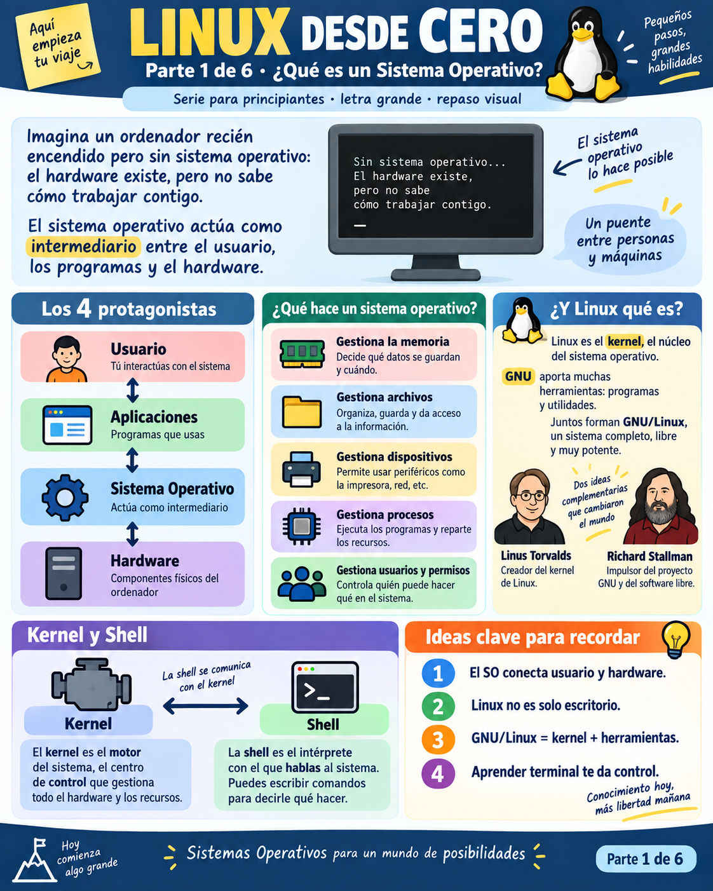
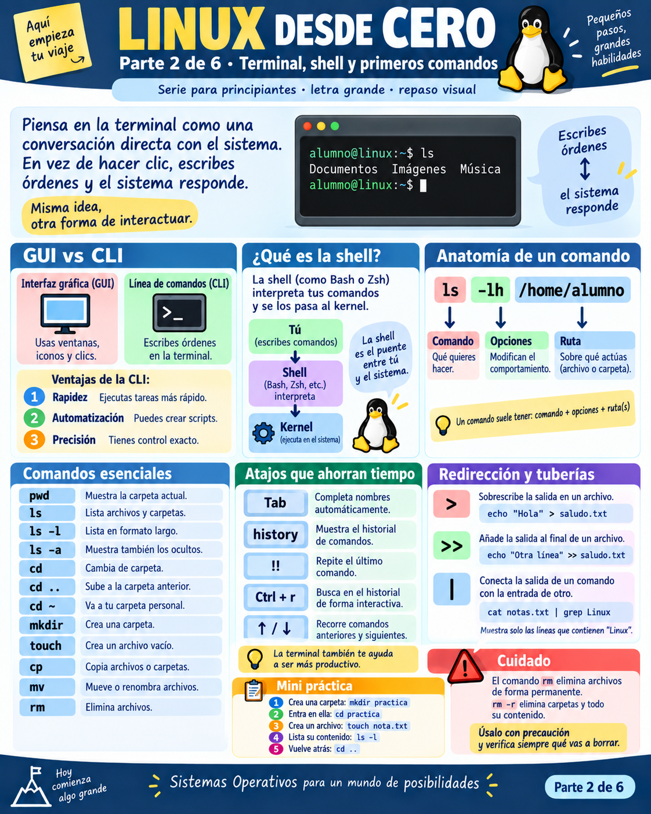
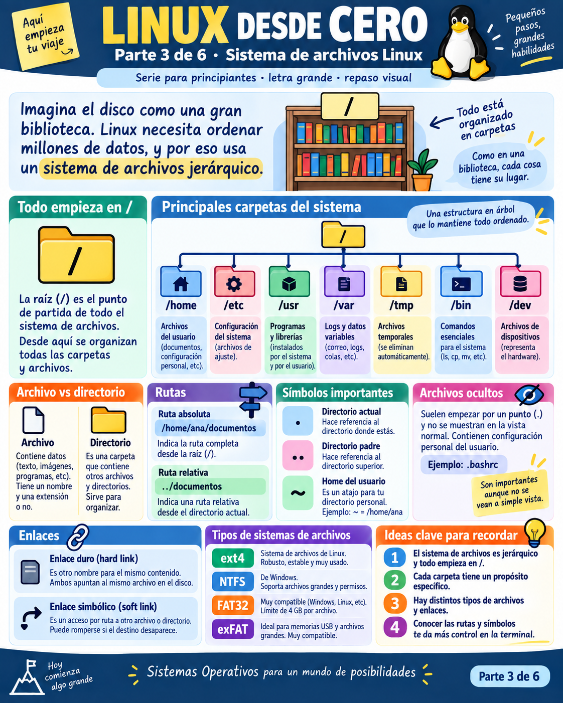
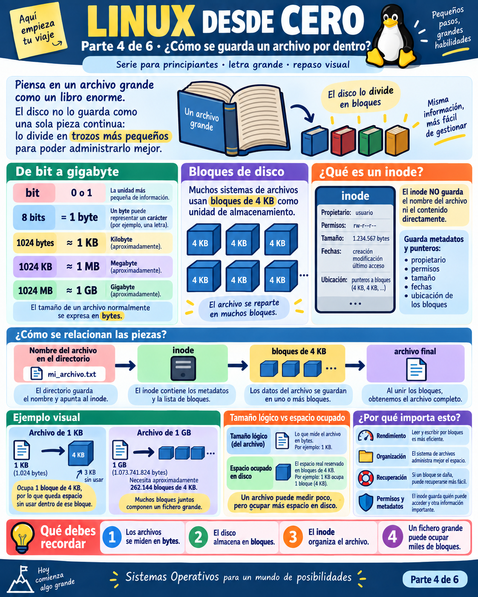
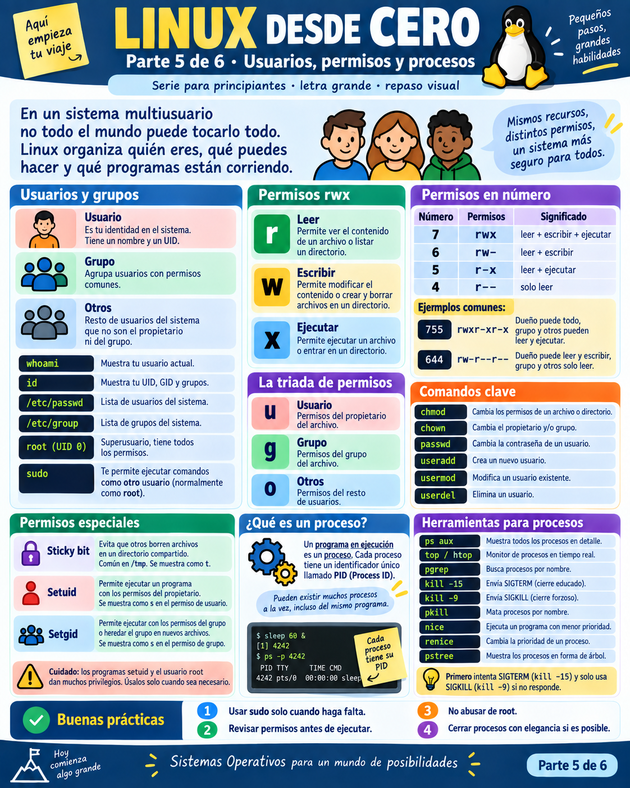
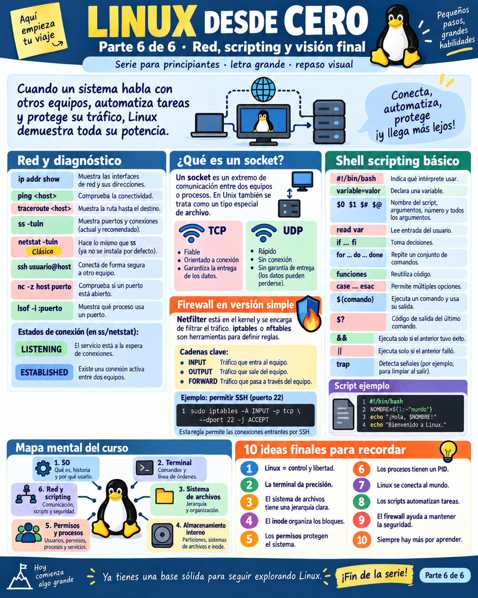

# 🐧 Operación Némesis: Crónicas de un SysAdmin en Linux
### *Práctica Guiada Paso a Paso a través de las 6 Dimensiones de GNU/Linux*

---

> **Bienvenido, Agente de Sistemas.**  
> Son las 03:42 AM. Has recibido una alerta de emergencia: el administrador principal del servidor de investigación **Némesis** ha desaparecido misteriosamente. La infraestructura está encendida pero desorientada. En los registros hay intentos de intrusión, procesos en segundo plano consumiendo memoria, archivos bloqueados y configuraciones desajustadas.
>
> Tu misión es tomar el control de la terminal, investigar cada rincón del sistema de archivos, desentrañar los misterios de inodos y permisos, neutralizar anomalías y dejar desplegado un centinela automatizado.
>
> **Tu única arma:** La Shell de Linux.

---

## 🧰 Caja de Herramientas: Gestión de Paquetes en Cualquier Linux

A lo largo de esta aventura usaremos herramientas del sistema base y otras más avanzadas (como `tree`, `htop`, `netcat`, `curl`). Dependiendo de la distribución Linux en la que estés (o si usas macOS), el gestor de paquetes cambia:

| Distribución | Gestor de Paquetes | Comando de Instalación de Ejemplo |
| :--- | :--- | :--- |
| **Ubuntu / Debian / Kali / Mint** | `apt` / `apt-get` | `sudo apt update && sudo apt install -y tree htop netcat-openbsd curl` |
| **Fedora / RHEL / Rocky / AlmaLinux** | `dnf` (o `yum`) | `sudo dnf install -y tree htop nc curl` |
| **Arch Linux / Manjaro** | `pacman` | `sudo pacman -Sy tree htop gnu-netcat curl` |
| **openSUSE** | `zypper` | `sudo zypper install -y tree htop netcat-openbsd curl` |
| **macOS (Terminal zsh)** | `brew` (Homebrew) | `brew install tree htop netcat curl` |

---

## 🚀 Despliegue del Laboratorio Seguro

Para no interferir con archivos personales de tu máquina, hemos preparado un laboratorio de simulación que recrea la estructura del servidor Némesis en una carpeta aislada.

Ejecuta desde la raíz del repositorio o dentro de la carpeta `linux/`:

```bash
# Si estás en la raíz del repo:
bash linux/scripts/preparar_mision_nemesis.sh

# O si ya estás dentro de la carpeta linux/:
bash scripts/preparar_mision_nemesis.sh
```

Una vez ejecutado, entra en el cuartel general de la misión:
```bash
cd laboratorio_nemesis
```

---

## 🧭 ACTO 1: ¿Qué es este Sistema? El Encuentro con el Kernel



### 📖 La Historia
Frente a ti parpadea el cursor de una pantalla negra. No hay botones, ventanas ni ratón. Solo texto esperando tus órdenes. Lo primero que debe saber cualquier SysAdmin antes de actuar es: **¿sobre qué motor estoy parado?**

El **Sistema Operativo** es el puente entre las personas y el silicio del hardware. Como muestra la infografía:
- **Kernel (Linux)**: El motor que controla CPU, memoria RAM y discos (creado por Linus Torvalds en 1991).
- **GNU**: Las herramientas, programas y compiladores libres que rodean al motor (impulsadas por Richard Stallman).
- **Shell**: El intérprete con el que estás a punto de hablar.

### 💻 Paso a Paso en la Terminal

#### 1. Identificar el Kernel y la Arquitectura
```bash
uname -a
```
* **¿Qué está pasando?**: `uname -a` (*Unix Name All*) le pide al kernel que revele su nombre, versión exacta de compilación, nombre de host y arquitectura de CPU (`x86_64`, `aarch64` / Apple Silicon).

#### 2. Consultar la Distribución exacta del Sistema
En sistemas GNU/Linux reales, la información de la distribución reside en `/etc`:
```bash
cat /etc/os-release 2>/dev/null || cat /etc/issue 2>/dev/null || uname -s
```
* **¿Qué está pasando?**: Leemos el archivo estandarizado que indica si es Ubuntu, Debian, Fedora, etc. El `2>/dev/null` silencia errores si el archivo no existe (útil en macOS).

#### 3. Descubrir tu Shell actual
```bash
echo $SHELL
echo "Mi intérprete de comandos es: $0"
```
* **¿Qué está pasando?**: La variable de entorno `$SHELL` muestra tu shell configurada por defecto (`/bin/bash` o `/bin/zsh`). `$0` te indica el proceso actual que está ejecutando tus órdenes.

---

## ⚔️ ACTO 2: La Terminal como Conversación Directa (Navegación y Tuberías)



### 📖 La Historia
Ahora que conoces el terreno, necesitas moverte por el servidor. Te han informado de que el antiguo administrador dejó un archivo de registro (*log*) con pistas antes de marcharse. Debes encontrarlo, examinarlo sin sobrecargar la pantalla y extraer únicamente los eventos críticos usando **tuberías (`|`)** y **redirecciones (`>`, `>>`)**.

### 💻 Paso a Paso en la Terminal

#### 1. ¿Dónde estoy parado?
```bash
pwd
```
* **¿Qué está pasando?**: `pwd` (*Print Working Directory*) muestra tu ruta actual absoluta. Debes estar dentro de `.../laboratorio_nemesis`.

#### 2. Inspeccionar el entorno
```bash
ls
ls -l
ls -la
```
* **¿Qué está pasando?**:
  - `ls`: Muestra carpetas y archivos visibles.
  - `ls -l`: Formato largo con permisos, dueño, tamaño y fecha.
  - `ls -la`: Incluye archivos ocultos (los que empiezan por `.`), como `.`, `..` o archivos de configuración.

#### 3. Viajar por la jerarquía
```bash
cd var/log
pwd
cd ../..
pwd
```
* **¿Qué está pasando?**: `cd var/log` desciende por ruta relativa. `cd ../..` sube dos niveles en el árbol jerárquico.

#### 4. Investigar el Log con Tuberías y Filtros
El log contiene decenas de eventos, pero tú solo buscas los incidentes de seguridad:
```bash
cat var/log/sistema.log
```
Ahora filtramos con una tubería hacia `grep`:
```bash
cat var/log/sistema.log | grep "SECURITY"
```
O de forma aún más eficiente (sin necesidad del `cat` intermedio):
```bash
grep -i -E "ALERT|CRITICAL" var/log/sistema.log
```
* **¿Qué está pasando?**: El pipe `|` toma la salida estándar (*stdout*) del comando de la izquierda y la inyecta como entrada estándar (*stdin*) al de la derecha. Con `-i` ignoramos mayúsculas/minúsculas y con `-E` buscamos múltiples patrones.

#### 5. Redirecciones: Crear un informe de incidentes
Exportemos estos hallazgos a un archivo nuevo:
```bash
# Sobrescribe o crea el archivo con >
grep "SECURITY" var/log/sistema.log > informe_amenazas.txt

# Añade al final sin borrar con >>
grep "CRITICAL" var/log/sistema.log >> informe_amenazas.txt

# Comprobamos el resultado
cat informe_amenazas.txt
```

#### 6. Atajos ninja de productividad en la terminal
Pruébalos ahora mismo:
- Pulsa la tecla **`Tab`**: Escribe `cd ho` y presiona `Tab` ➔ La terminal autocompleta a `home/`.
- **Historial interactivo**: Pulsa **`Ctrl + R`** y teclea `informe` ➔ La shell buscará instantáneamente el comando anterior donde usaste esa palabra.
- **Repetir último comando**: Escribe `!!` y presiona Enter.

---

## 🏛️ ACTO 3: La Gran Biblioteca del Sistema de Archivos y los Enlaces



### 📖 La Historia
En Linux existe una máxima legendaria: **«En UNIX, todo es un archivo»** (programas, documentos, discos e incluso las conexiones de red). Toda esta inmensa biblioteca cuelga de un único punto de origen: la raíz `/`.

Dentro de `home/agente/`, el antiguo SysAdmin preparó un paquete de datos llamado `transmision.dat`. Pero observas dos archivos similares: `transmision_respaldo.dat` y `acceso_directo_transmision.lnk`. ¿Son copias independientes que ocupan el doble de espacio o son enlaces?

### 💻 Paso a Paso en la Terminal

#### 1. Conocer las carpetas sagradas del sistema raíz (`/`)
Repasa para qué sirve cada una según la infografía:
- `/etc`: Archivos de configuración del sistema (como `servidor.conf` o `passwd`).
- `/var`: Datos variables en constante crecimiento (como `/var/log`).
- `/home`: Espacio personal de cada usuario humano.
- `/tmp`: Archivos temporales (se vacían al reiniciar).
- `/bin`: Binarios y comandos ejecutables esenciales (`ls`, `cp`, `bash`).
- `/dev`: Representación como archivos de dispositivos de hardware (`/dev/null`, discos).

#### 2. Enlaces Duros (*Hard Links*) vs Enlaces Simbólicos (*Symlinks*)
Ve a la carpeta del agente y fíjate en el número de inodo de cada archivo con `ls -li`:
```bash
cd home/agente
ls -li
```
* **Observa con atención la primera columna**:
  - `transmision.dat` y `transmision_respaldo.dat` **TIENEN EXACTAMENTE EL MISMO NÚMERO DE INODO**.
  - No son dos copias: son dos nombres apuntando a la **misma habitación física del disco**.
  - En cambio, `acceso_directo_transmision.lnk` tiene un número de inodo diferente y una flecha `->`. Es un puntero por ruta.

#### 3. El Experimento de la Destrucción
¿Qué pasa si borramos el archivo original?
```bash
# Leemos primero el contenido a través del enlace blando
cat acceso_directo_transmision.lnk

# Borramos el archivo original
rm transmision.dat

# ¿Sobrevivió el hard link?
cat transmision_respaldo.dat

# ¿Qué le pasó al enlace simbólico?
cat acceso_directo_transmision.lnk
```
* **¡Sorpresa del SysAdmin!**:
  - `transmision_respaldo.dat` **sigue intacto**: El contenido no se borra del disco mientras exista al menos un hard link apuntando a su inodo.
  - `acceso_directo_transmision.lnk` **se rompe** (*Dangling Symlink*): Da error `No such file or directory` porque su ruta de destino ya no existe.

Regresemos a la base:
```bash
cd ../..
```

---

## 🔬 ACTO 4: Rayos X al Disco: Inodos, Bloques y Tamaños Fantasma



### 📖 La Historia
El hardware no entiende de nombres de archivos simpáticos; entiende de **bloques de almacenamiento de 4 KB** y de números de catálogo llamados **inodes (nodos-índice)**.
Un inodo guarda:
1. Quién es el dueño (`UID`, `GID`).
2. Qué permisos tiene (`rwxr-xr-x`).
3. Cuánto mide.
4. Fechas de acceso, modificación y cambio (`atime`, `mtime`, `ctime`).
5. Dónde están los bloques en los que se dividió el contenido.

**Curiosidad clave:** El inodo **NO guarda el nombre del archivo**. El nombre solo vive en el directorio, asociando un texto a un número de inodo.

### 💻 Paso a Paso en la Terminal

#### 1. Inspeccionar las entrañas de un archivo con `stat`
```bash
stat etc/servidor.conf
```
* **¿Qué estás viendo?**:
  - `Inode`: El número único de carnet de identidad del archivo.
  - `Links`: Cuántos nombres apuntan a este inodo.
  - `Blocks`: Cuántos bloques físicos tiene asignados en el disco.
  - `Access / Modify / Change`: Los timestamps exactos.

#### 2. Tamaño Lógico vs Espacio Real en Disco (`ls` vs `du`)
Crea un archivo pequeño de texto de solo 15 caracteres:
```bash
echo "Hola SysAdmin" > mini.txt
ls -lh mini.txt
du -h mini.txt
```
* **¿Qué está pasando?**:
  - `ls -lh` te dice que mide unos 14 bytes (tamaño lógico).
  - `du -h` (*Disk Usage*) te dirá que ocupa **4 KB** (el tamaño mínimo de 1 bloque del sistema de archivos). ¡El disco no puede asignar medio bloque!

#### 3. Magia Negra de Sistemas: Creando un Archivo Disperso (*Sparse File*) de 1 GB que no ocupa nada
¿Puede existir un archivo que declare medir 1 Gigabyte pero ocupe cero bloques reales?
```bash
# Creamos un archivo de 1GB con dd usando seek (o truncate)
dd if=/dev/zero of=archivo_fantasma.img bs=1M count=0 seek=1024 2>/dev/null || truncate -s 1G archivo_fantasma.img 2>/dev/null

# Comparamos
ls -lh archivo_fantasma.img
du -h archivo_fantasma.img
```
* **Lección de oro:** `ls` reporta `1.0G`, pero `du` reporta `0B`. Linux asigna bloques bajo demanda; como solo contiene huecos vacíos, no gasta espacio físico real hasta que escribas datos.

Limpia el archivo de prueba:
```bash
rm -f mini.txt archivo_fantasma.img
```

---

## 🛡️ ACTO 5: Usuarios, Permisos Especiales y la Caza del Proceso Fantasma



### 📖 La Historia
Revisando los registros descubriste una alarma crítica: alguien intentó acceder a `srv/backup/clave_secreta.txt`, y además hay un proceso sospechoso corriendo en segundo plano que podría estar enviando datos fuera. Tienes que auditar los permisos, proteger el archivo confidencial y neutralizar el proceso.

### 💻 Paso a Paso en la Terminal

#### 1. ¿Quién soy y qué permisos tengo?
```bash
whoami
id
```
* **¿Qué está pasando?**: `whoami` muestra tu nombre de usuario. `id` muestra tu `uid` numérico, tu `gid` principal y los grupos secundarios a los que perteneces. En Linux, el superusuario todopoderoso es **`root` (UID 0)**.

#### 2. Entender los permisos `rwx` y el valor octal
Observa la tabla de la infografía:
- **r** (Read) = **4**
- **w** (Write) = **2**
- **x** (Execute) = **1**

| Permiso | Cálculo | Significado |
| :--- | :--- | :--- |
| `755` | `(4+2+1)(4+0+1)(4+0+1)` ➔ `rwxr-xr-x` | Dueño todo; grupo y otros solo leen y ejecutan. |
| `644` | `(4+2+0)(4+0+0)(4+0+0)` ➔ `rw-r--r--` | Dueño lee y escribe; resto solo lee. |
| `600` | `(4+2+0)(0+0+0)(0+0+0)` ➔ `rw-------` | Solo el dueño tiene acceso confidencial. |

#### 3. Blindar el archivo secreto
```bash
ls -l srv/backup/clave_secreta.txt
chmod 600 srv/backup/clave_secreta.txt
ls -l srv/backup/clave_secreta.txt
```

#### 4. Permisos Especiales: El Sticky Bit (`+t`)
¿Por qué en `/tmp` cualquiera puede crear archivos pero nadie puede borrar los de otro usuario? Gracias al **Sticky Bit**:
```bash
mkdir -p compartido
chmod 1777 compartido  # o chmod +t compartido
ls -ld compartido
```
* **Fíjate en el resultado**: Aparece una **`t`** al final (`drwxrwxrwt`). Ese directorio ahora protege los archivos de sus respectivos dueños contra borrados maliciosos de terceros.

#### 5. Caza del Proceso Fantasma
Lanza el script del fantasma en segundo plano añadiendo el ampersand `&`:
```bash
./bin/proceso_fantasma.sh &
```
La terminal te devolverá el número de trabajo y su **PID** (ejemplo: `[1] 12345`).

Búscalo en la tabla de procesos del sistema:
```bash
ps aux | grep "proceso_fantasma" | grep -v grep
```
O con el comando especializado `pgrep`:
```bash
pgrep -f "proceso_fantasma"
```

#### 6. Neutralizar el proceso: SIGTERM vs SIGKILL
Nunca lances `kill -9` a la primera. Las buenas prácticas de Linux dictan:
1. **Paso 1: Petición educada (SIGTERM / -15)**: Da tiempo al proceso a guardar datos y cerrar sockets.
   ```bash
   pkill -15 -f "proceso_fantasma"
   ```
2. **Paso 2: Comprobar si murió**:
   ```bash
   pgrep -f "proceso_fantasma"
   ```
3. **Paso 3 (Solo si sigue vivo rebelde): Fuerza bruta (SIGKILL / -9)**: El kernel corta el proceso de raíz sin dejarle despedirse.
   ```bash
   pkill -9 -f "proceso_fantasma" 2>/dev/null || echo "Proceso ya neutralizado."
   ```

---

## 🌐 ACTO 6: Redes, Sockets, Firewall y el Script Centinela



### 📖 La Historia
El servidor está a salvo internamente, pero un servidor que no se comunica con el mundo exterior no sirve de nada. Debes inspeccionar las interfaces de red, comprobar si el puerto de servicio `8080` está escuchando conexiones, y automatizar un **Script Centinela en Bash** con control de señales para que audite el sistema periódicamente.

### 💻 Paso a Paso en la Terminal

#### 1. Auditoría de red e interfaces
```bash
# Ver direcciones IP e interfaces activas (herramienta moderna iproute2)
ip addr show 2>/dev/null || ifconfig 2>/dev/null
```

#### 2. Puertos y Sockets en escucha
¿Qué puertos están abiertos esperando conexiones?
```bash
# El estándar moderno: ss (Socket Statistics)
ss -tuln 2>/dev/null || netstat -tuln 2>/dev/null
```
- **`-t`**: TCP (fiable, ordenado, orientado a conexión).
- **`-u`**: UDP (rápido, sin conexión previa, para streaming o DNS).
- **`-l`**: Solo sockets en estado `LISTENING`.
- **`-n`**: Muestra números de puertos en vez de intentar resolver nombres.

#### 3. Cortafuegos (Firewall): El guardián Netfilter
El kernel de Linux integra **Netfilter**. Herramientas como `iptables`, `nftables` o `ufw` permiten definir qué paquetes entran y salen:
- Cadena **INPUT**: Tráfico que llega a este servidor.
- Cadena **OUTPUT**: Tráfico que sale de este servidor.
- Cadena **FORWARD**: Tráfico que pasa a través de este servidor hacia otra máquina.

*Ejemplo clásico de regla para permitir SSH seguro en puerto 2222:*
```bash
# (Sintaxis de referencia iptables)
# sudo iptables -A INPUT -p tcp --dport 2222 -j ACCEPT
```

---

## 🤖 DESAFÍO FINAL: Desarrollar el Script Centinela de Némesis

Como cierre de tu misión, crearás un script en Bash en `bin/centinela.sh` que:
1. Compruebe el estado del servidor.
2. Cuente cuántas alertas de seguridad hay en el log.
3. Detecte si un archivo crítico existe.
4. Use una trampa `trap` para despedirse limpiamente al recibir `Ctrl + C`.

Crea el archivo `bin/centinela.sh`:

```bash
cat << 'EOF' > bin/centinela.sh
#!/usr/bin/env bash
# ==============================================================================
# CENTINELA NÉMESIS v1.0 - Monitor de Integridad del Sistema
# ==============================================================================

# Capturar señal de interrupción (SIGINT / Ctrl+C) con trap
trap 'echo -e "\n🛑 [CENTINELA] Interrupción recibida. Cerrando patrulla con honor."; exit 0' SIGINT

NOMBRE_HOST=$(hostname)
FECHA=$(date "+%Y-%m-%d %H:%M:%S")

echo "========================================================"
echo "🛡️  PATRULLA CENTINELA ACTIVADA EN: ${NOMBRE_HOST}"
echo "📅  Fecha: ${FECHA}"
echo "👤  Operador: $(whoami)"
echo "========================================================"

# 1. Comprobación de argumentos
if [ $# -gt 0 ]; then
    echo "ℹ️  Modo especial activado: $1"
fi

# 2. Análisis de incidentes en el log
ARCHIVO_LOG="var/log/sistema.log"
if [ -f "$ARCHIVO_LOG" ]; then
    TOTAL_ALERTAS=$(grep -c -E "ALERT|CRITICAL|SECURITY" "$ARCHIVO_LOG")
    echo "🔍 Análisis de logs ($ARCHIVO_LOG):"
    echo "   ⚠️ Incidentes críticos detectados: ${TOTAL_ALERTAS}"
    
    if [ "$TOTAL_ALERTAS" -gt 0 ]; then
        echo "   🚨 ALERTA: Se requiere auditoría manual de los siguientes eventos:"
        grep -n -E "ALERT|CRITICAL" "$ARCHIVO_LOG" | head -n 3
    else
        echo "   ✅ Sin anomalías registradas."
    fi
else
    echo "⚠️ Archivo de log no encontrado en $ARCHIVO_LOG"
fi

# 3. Comprobación de seguridad en clave confidencial
ARCHIVO_CLAVE="srv/backup/clave_secreta.txt"
if [ -f "$ARCHIVO_CLAVE" ]; then
    PERMISOS=$(ls -l "$ARCHIVO_CLAVE" | awk '{print $1}')
    echo "🔐 Estado de clave ($ARCHIVO_CLAVE):"
    echo "   Permisos actuales: $PERMISOS"
    if [ "$PERMISOS" == "-rw-------" ]; then
        echo "   ✅ BLINDADO: Solo el propietario tiene lectura/escritura."
    else
        echo "   ⚠️ VULNERABLE: Corregir permisos inmediatamente con 'chmod 600'."
    fi
fi

echo "========================================================"
echo "🏆 [MISIÓN CUMPLIDA] El servidor Némesis está bajo control."
echo "========================================================"
EOF
```

Dale permisos de ejecución y pruébalo:
```bash
chmod +x bin/centinela.sh
./bin/centinela.sh "Inspección Rutinaria"
```

---

## 🏆 Resumen de los 10 Mandamientos del SysAdmin Linux

1. **Linux te da control y libertad**: Lo que tú ordenas, el kernel lo ejecuta sin rechistar.
2. **La terminal te da precisión**: Con pipes y filtros puedes procesar millones de líneas en segundos.
3. **El sistema de archivos es un árbol**: Todo empieza en `/`, no hay letras de unidad tipo `C:\`.
4. **El inodo es el verdadero archivo**: El nombre es solo una etiqueta que apunta a él.
5. **Los permisos te protegen**: `chmod 600` para secretos, `755` para programas, `644` para lectura general.
6. **Todo proceso tiene un PID**: Monitorea con `ps`, `top/htop` y mata primero con `kill -15`.
7. **Linux se conecta al mundo**: Domina `ss`, `ip`, `curl` y los estados de sockets.
8. **Los scripts automatizan tu vida**: Un buen SysAdmin escribe scripts para no repetir trabajo.
9. **El firewall es tu muralla**: Netfilter vigila la frontera de paquetes.
10. **Aprender terminal te da superpoderes**: El conocimiento que adquieras hoy en Linux te servirá en servidores, contenedores Docker, nubes AWS/GCP/Azure y sistemas embebidos durante décadas.
